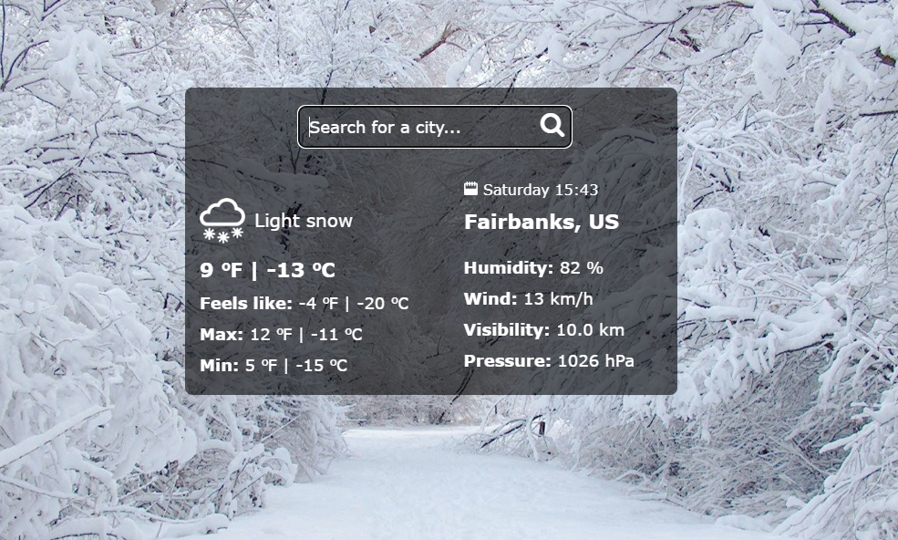
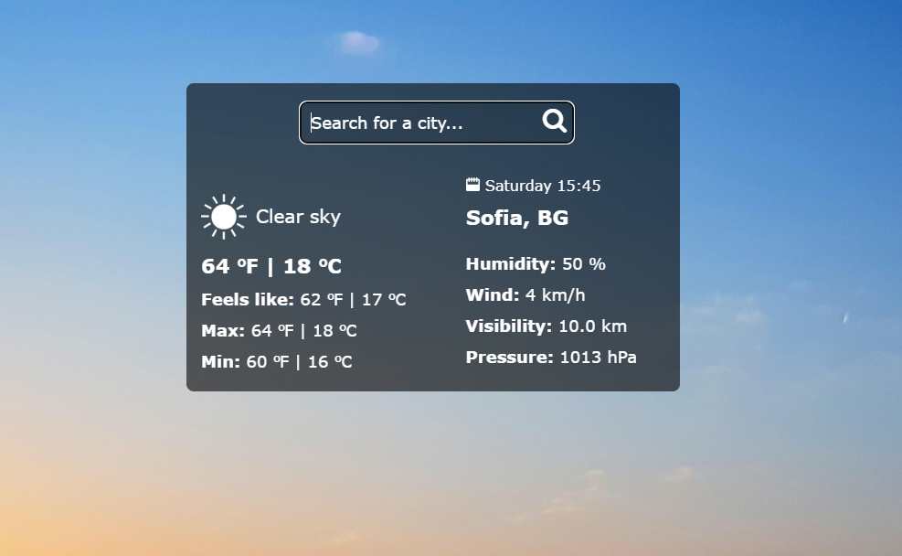

## Weather App made with React.


<br/>


The weather's data comes from <a href="https://openweathermap.org/" target="_blank">openweathermap.org</a>, so you need an API key.

To get a local copy of the code, clone it using git:

```
git clone https://github.com/92gahov/Weather-App
```

In **root** directory create **.env** file and put your API key in it.


Install dependencies:

```
npm install
```

Now, you can start a local web server by running:

```
npm start
```

### `Final result` <a href="https://weather-app-app.onrender.com/" target="_blank">here</a>